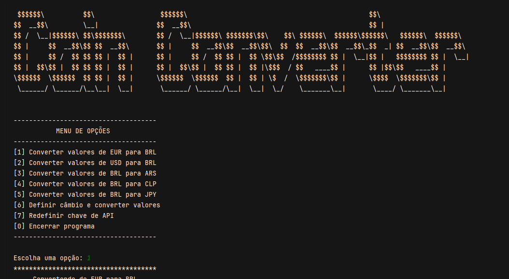

#  Coin Converter

## Descrição


Este projeto foi desenvolvido para o Desafio do Curso de Java da Alura como parte do programa ONE, a proposta consiste na criação de um programa que execute no terminal e consiga obter taxas de câmbio dinamicamente por meio da API ExchangeRate, e então realize conversões entre diferentes moedas.

## Tecnologias utilizadas
- Java 17
- Biblioteca Gson
- Exchange Rate API

## Como obter e utilizar a chave da API?
É necessário gerar uma chave da [ExchangeRate-API](https://www.exchangerate-api.com/) para que seja possível obter as taxas de câmbio em tempo real. Então acesse ao site, procure pelo botão "Get Free Key" e forneça um email válido para que a chave seja gerada e associada a sua conta.

Ao executar o programa ele vai pedir que você insira a chave sem necessidade de mexer diretamente no código, mas se for da sua preferência, é só inserir como parâmetro no construtor da classe ApiConnection presente na classe Main da seguinte forma: 

```Java
ApiConnection connection = new ApiConnection("YOUR-API-KEY");
```


